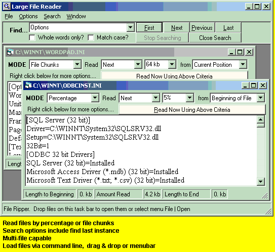

## LaVolpe Large File Reader

### Description

Used to view huge files. I use daily to review last 1mb of 30+ meg files. Loads only portions of a file (by chunk size or percentage) instead of entire file & is quick.   Feel free to use & abuse as you like.
 
### More Info
 

             |
---                |---
**Submitted On**   |2002-06-13 18:46:36
**By**             |[LaVolpe](https://github.com/Planet-Source-Code/PSCIndex/blob/master/ByAuthor/lavolpe.md)
**Level**          |Advanced
**User Rating**    |5.0 (55 globes from 11 users)
**Compatibility**  |VB 6\.0
**Category**       |[Files/ File Controls/ Input/ Output](https://github.com/Planet-Source-Code/PSCIndex/blob/master/ByCategory/files-file-controls-input-output__1-3.md)
**World**          |[Visual Basic](https://github.com/Planet-Source-Code/PSCIndex/blob/master/ByWorld/visual-basic.md)
**Archive File**   |[LaVolpe\_La14995711182002\.zip](https://github.com/Planet-Source-Code/lavolpe-lavolpe-large-file-reader__1-40842/archive/master.zip)

